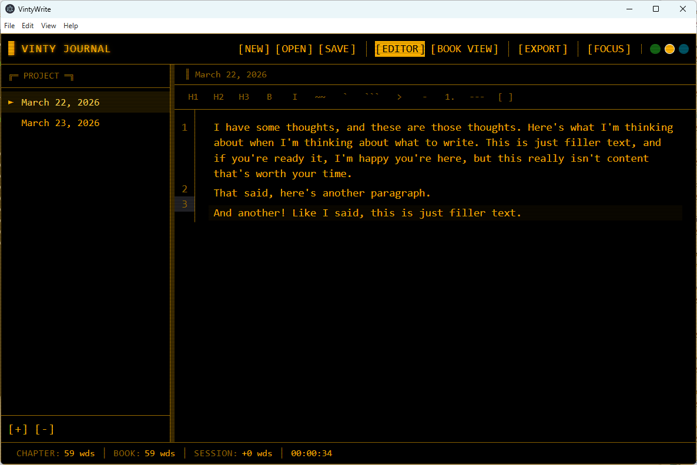

# Welcome to VintyWrite!

VintyWrite is a distraction-free writing tool that combines the ability to create multichapter documents with the simplicity of Markdown. You can create books, journals, notes or other multi-chapter documents, or just use it for jotting down quick ideas. The application installers are available on Windows and Mac under "Releases" or you can grab the source code yourself from here. If you have a feature idea or a bug, enter it as an Issue.

Features are:

1. Simple, straightforward interface
2. Focus mode for reduced distraction
3. All content is in non-proprietary Markdown
4. Export to PDF or Word formats
5. Find and replace
6. Session timer and word counter
7. Quick resume of last-open book
8. Drag-and-drop chapter reordering
9. Three old-school color schemes: classic green, business amber, bold blue

Want to try it? [Get an installer from the releases page](https://github.com/lclontz/VintyWrite/releases)!

Documents are called "books," each of which maps to a directory, and subsections are called "chapters," each of which maps to a Markdown file, with a manifest file inside that the application uses to keep everythiing aligned. You don't have to use it just for books -- use it however you like and let me know if you have any feedback at clontz@gmail.com!
